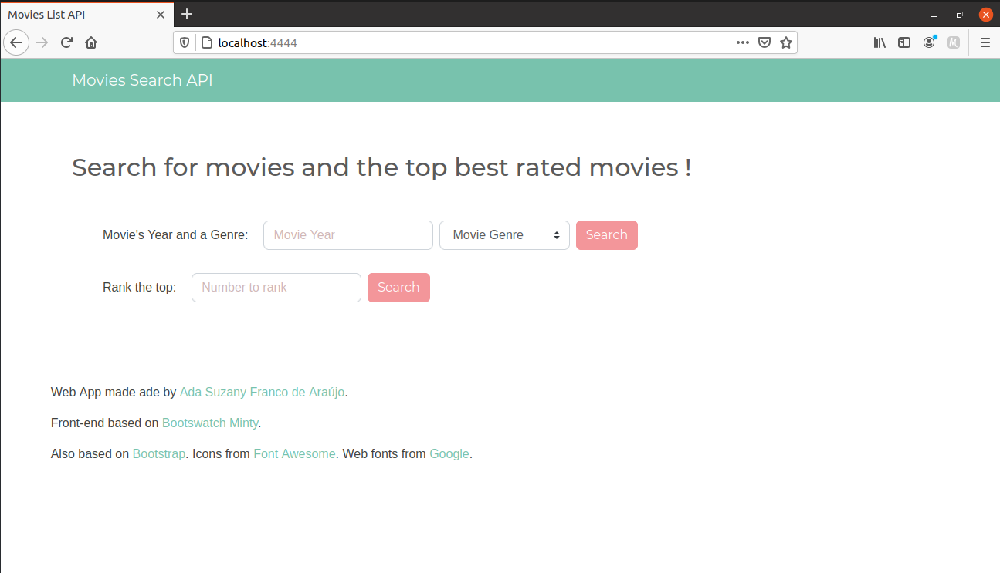
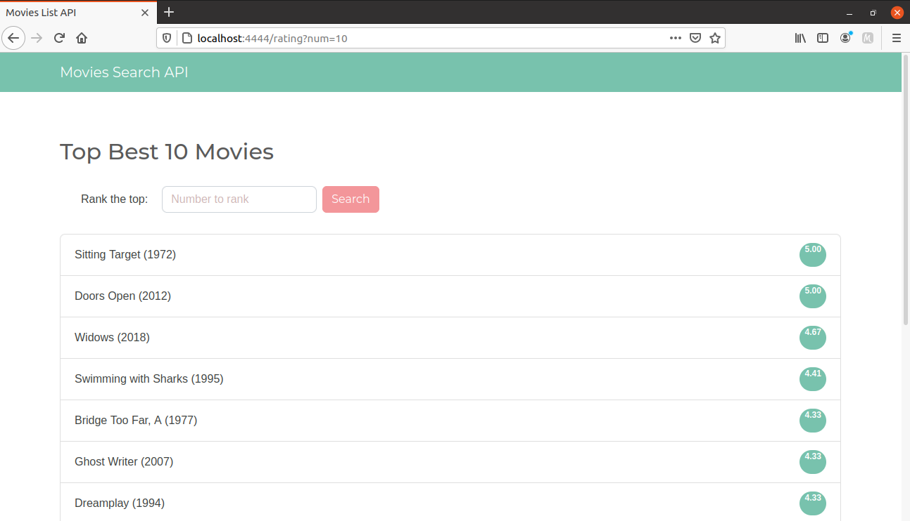
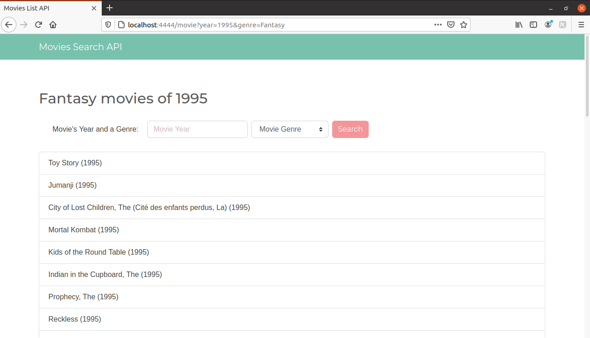

# Programming Challenge

This challenge consists of a web applicantion and api development. Read the instructions carefully to execute the solution.

## Status

:construction: In construction

## Getting Started
### Database

The files ```movie.csv``` and ```rating.csv``` from [MovieLens](https://grouplens.org/datasets/movielens/) is updated at ```/dataset```. To execute the dataset treatment execute:
$ cd database
$ python3 parser.py

That will create ```genres.csv``` file.

SQLite is used, so the database its the file ```database.sqlite3```.

After create de database we need to populate it, executing:
$ node db.js

### Prerequisites

Before start, you need to get installed those tools:

	[Git](https://git-scm.com),
	[Node.js](https://nodejs.org/en).

### Executing

Install all the dependences execute:
$ npm install

Run app, execute:
$ npm start

## Technologies

The following technologies were used in this project:
- [Node.js](https://nodejs.org/en/)
- [EJS](https://ejs.co/)
- [Sequelize](https://sequelize.org/)
- [SQLite](https://www.sqlite.org/index.html)
- [Sass](https://sass-lang.com/)
- [Bootstrap](https://getbootstrap.com/)
- [@fortawesome/fontawesome-free](https://fontawesome.com/)

## Screenshots
<h1 align='center'>
	
</h1>

<h1 align='center'>
	
</h1>

<h1 align='center'>
	
</h1>


